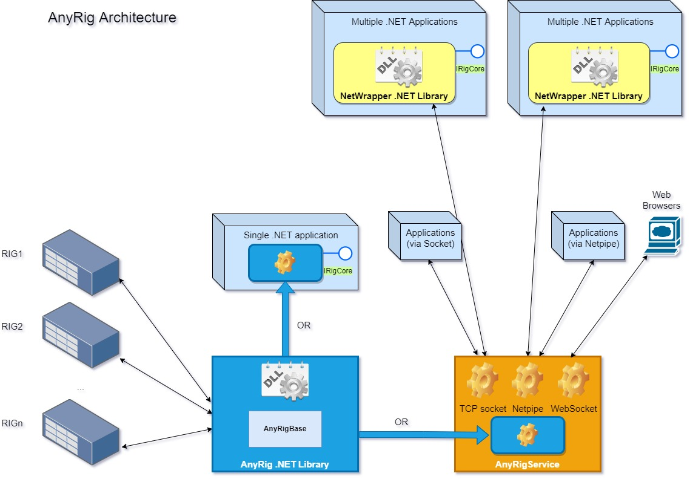
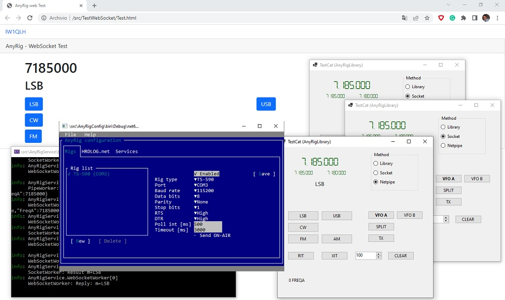

# AnyRig


AnyRig is a library for transceiver/receiver CAT control.
Through the library it's possible to read/write these RIG parameters:
- frequency of VFO
- frequency of VFO A
- frequency of VFO B
- RIG mode (CW, CWR, USB, LSB, DIGR, DIG, AM, FM)
- Pitch
- RIT
- XIT
- RIT/XIT offset
- SPLIT
- TX/RX
- VFO mode (VFOAA, VFOAB, VFOBA, VFOBB, VFOA, VFOB)

## AnyRigBase

[](https://www.nuget.org/packages/AnyRigBase)

The class library AnyRigBase derives from OmniRig (http://www.dxatlas.com/OmniRig/), the great work of Alex VE3NEA.
The INI files written for OmniRig are compatible with this library.

## AnyRigLibrary

[](https://www.nuget.org/packages/AnyRigLibrary)

It's the .NET library by which to control the RIG. 
There is no limit on the number of attached transceivers.
This library can be used directly by a .NET application.

## AnyRig Config
It's a application that can run on Windows, Linux and macOS that allows you to configure the AnyRig system.
You can set up your RIGs and configure the AnyRig Service.

## AnyRig Service
It's a service that can run on Windows, Linux and macOS that accept TCP socket, Netpipe and Websocket connections.
This service can be used at the same time by more applications (written using any language) and more web browsers.
Data are exchanged using text messages similar to that of rigctld.

### Commands:
| Parameter | Get (short) | Get (long) | Set (short) | Set (long) | Note |
|---|---|---|---|---|---|
| VFO: get frequency | f | get_freq | F | set_freq | Frequency in Hz |
| VFO A: get frequency | fa | get_freqa | FA | set_freqa | Frequency in Hz |
| VFO B: get frequency | fb | get_freqb | FB | set_freqb | Frequency in Hz |
| VFO: mode | v | get_vfo | V | set_vfo| VFOAA, VFOAB, VFOBA, VFOBB, VFOA, VFOB |
| Mode | m | get_mode | M | set_mode | CW, CWR, USB, LSB, DIGR, DIG, AM, FM |
| PTT | t | get_ptt | T | set_ptt | ON, OFF |
| SPLIT | s | get_split_vfo | S | set_split_vfo | ON, OFF |
| PITCH level | l CWPITCH | get_level CWPITCH | L CWPITCH | set_level CWPITCH | |
| RIT | u RIT | get_func RIT | U RIT | set_level RIT | ON, OFF |
| XIT | u XIT | get_func XIT | U XIT | set_level XIT | ON, OFF |
| RIT offest | j | get_rit | J | set_rit | clear_rit: set RIT offset to 0 |
| RIGS list | | get_rigs | | | Returns the rigs list |

### Multiple RIGs
| Command | RIG affected |
|---|---|
| f | execute command on Rig 0 |
| f(0) | execute command on Rig 0 |
| f(1) | execute command on Rig 1 |

## AnyRig.Netwrapper
It's a .NET library that has the same interface of AnyRig Library but can be used by more .NET applications at the same time connected through AnyRig Service.

## AnyRigLibrary and AnyRig.Netwrapper usage
```C#
using AnyRigLibrary;
using AnyRigLibrary.Models;
using AnyRigNetWrapper;

    void Demo()
    {
        IRigCore rig = null;

        if (useLibrary)
        {
            AnyRigConfig config = ConfigManager.Load();
            RigCore[] rigs = ConfigManager.LoadRigs(config);

            if (rigs.Length > 0)
            {
                rig = rigs[0];
                rig.Start();
            }
        }
        else if (useSocket)
        {
            rig = new SocketRigWrapper();
        }
        else if (useNetpipe)
        {
            rig = new NetpipeRigWrapper();
        }

        rig.NotifyChanges = (rx, changed) => OnChanges(rx, changed);

        rig.Freq = 7100000;
        
    }        

```

## TestCat
A simple form application by which it's possible to test the base function of the library (using AnyRigLibrary or AnyRig.Netwrapper)

## TestWebSocket
A simple web page which it's possible to test the base function of the AnyRig Service (using WebSocket connection)

## IRigCore
It's the interface shared by AnyRigLibrary and AnyRig.Netwrapper.
Any .NET application can uses one or other library changing a single line of code.

```C#
    public interface IRigCore
    {
        long Freq { get; set; }
        long FreqA { get; set; }
        long FreqB { get; set; }
        RigParam Mode { get; set; }
        int Pitch { get; set; }
        string RigType { get; }
        bool? Rit { get; set; }
        int RitOffset { get; set; }
        bool? Split { get; set; }
        bool? Tx { get; set; }
        RigParam Vfo { get; set; }
        bool? Xit { get; set; }

        void ClearRit();

        List<RigBaseData> GetRigsList();
    }
```

## Credits

The AnyRigBase library derives from OmniRig. AnyRig and OmniRig are distrubuited under MPL license. Please mention license and both libraries in your project.

## Architecture


## Screenshot

